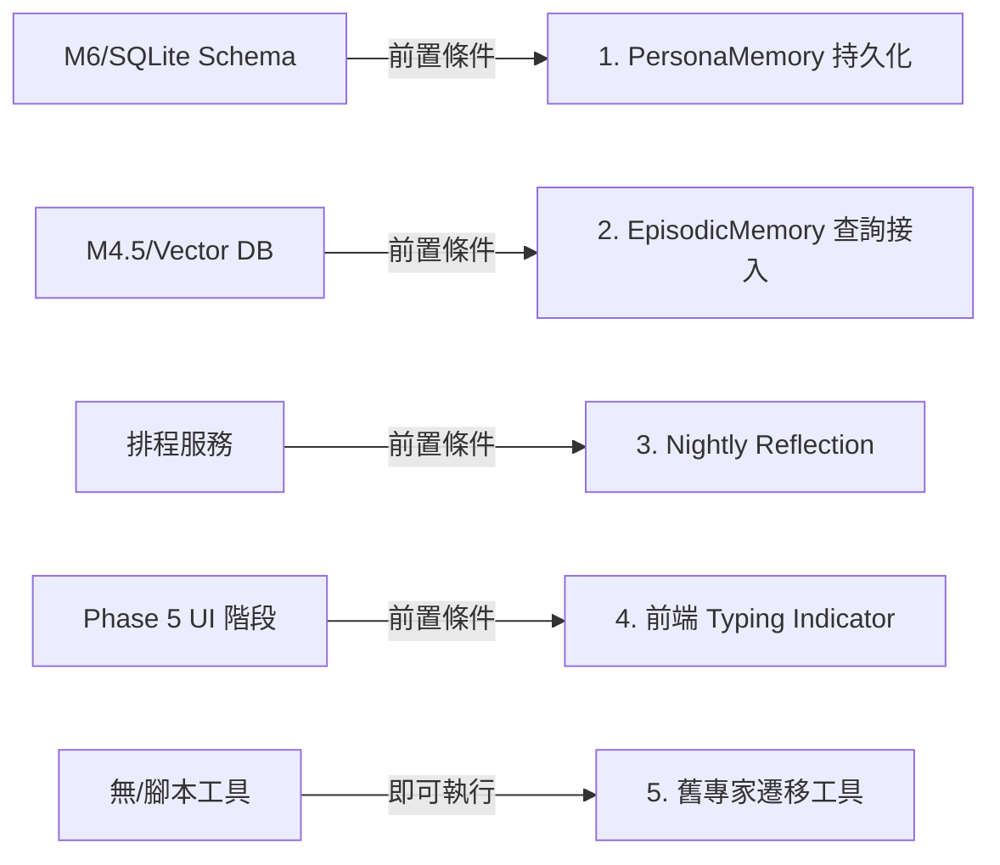

# MVP 建構順序 (Implementation Phases)

**版本**:1.0

> 此檔案是「下一步做什麼」的唯一權威來源。每完成一個 Phase 必須產出對應的 Closure Report。

## Phase 0: 專案基礎 (預估 1 週) ✅ 已完成

**目標**:讓 Claude Code 能在 VS Code 開始幹活。

```bash
# 完成定義
- [x] git init, .gitignore 建好
- [x] CLAUDE.md + docs/ 全部 commit
- [x] .claude/skills/ 三個 skill 全部建好
- [x] pnpm + uv 環境,monorepo 結構
- [x] CI 跑得起來 (pytest + vitest 空殼)
- [x] 三個 MCP server 在 .mcp.json 配置完成
```

**驗收**:在 VS Code 開啟專案 → Claude Code panel 啟動 → 輸入「請列出所有 MVP 模組」→ 它能回出 24 個模組。

> **完成日期**:2026-05-30

---

## Phase 1: 基礎設施 + 資料庫 (預估 2 週)

**模組**:`M0 (全部) + M6 (全部 MVP)`

```
M0.1 Monorepo  →  M0.2 Tauri IPC  →  M0.3 .env + Alembic  →  M0.4 結構化日誌
                                                                  ↓
M6.1 SQLite schemas  ←  M6.2 PostgreSQL  ←  M6.3 角色情境表  ←  M6.4 daily_reflections
                                                                  ↓
                                                              M6.5 ACID 抽卡守門員
```

**Phase Closure**:可以從 Tauri 前端送 ping → Rust → FastAPI → SQLite → PostgreSQL → Neo4j 一條龍,任一節點失敗都能在 raw_tracking_logs 看到事件。

---

## Phase 2: 邊緣推論 + 隱私防禦 (預估 2 週) ✅ 已完成

**完成日期**:2026-06-01
**模組**:`M2.1 + M2.2 + M2.3`

```
M2.1 事件防抖排隊  →  M2.2 Gemma 邊緣推論  →  M2.3 Eguard 基礎過濾
```

**Phase Closure**:M2.1~M2.3 管線實裝並通過 149/149 測試。PII 遮蔽、DRIFT 注入防禦、意圖向量壓縮（含降級模式）均已驗證。Supabase 雲端連線實測跑通。ai.local latency 測試已成功以 IP `192.168.1.65` 直連解鎖並通過測試。

**整合風險檢查**:

- ✅ RISK-M2.1-A/C:離線 buffer + 角色切換強制 Flush
- ✅ RISK-05:source_log_id 強制非空（含降級模式）
- ✅ RISK-M2.3-A/C:.eguardignore 豁免 + DRIFT 繞過 M2.2 佇列
- ⏳ RISK-12:IntentVector visibility 預設 private（M3.7 Phase 6+ 實作）

---

## Phase 3: 端側感知 (預估 2 週)

**模組**:`M1.1 + M1.2 + M1.3 + M1.4`

```
M1.1 OS 級遙測  →  M1.2 斷點偵測  →  M1.3 IDE/Browser 擴充  →  M1.4 Git 與工作流遙測 (本地 Git + Webhook)
```

**Phase Closure**:筆電上 VS Code 打 30 分鐘程式碼 → `raw_tracking_logs` 出現完整事件 → M1.2 在切換到瀏覽器時派發 BREAKPOINT 事件。

**整合風險檢查**:
- ✅ M1.2 + 未來的 M3 通知:確認 RISK-04 (Defer-to-Breakpoint vs 即時慶祝分流)

---

## Phase 4: Agent 邏輯核心 (預估 3 週)

**模組**:`M4.1 + M4.2 + M4.3 + M4.4 + M4.5 + M4.6`
> M4.7 Obsidian 同步已移至 Phase 6（2026-06-10 拍板，理由：MVP 閉環不依賴 Obsidian，優先保證核心對話迴路完整）。

```
M4.1 路由結構  ─┬→  M4.2 Persona 工程  →  M4.3 角色隔離
                │
                └→  M4.6 Observer
                       ↓
              M4.4 自然套問 + 草稿  →  M4.5 XP 自動結算
```

**Phase Closure**:對話一輪後 → `chat_transcripts` 入庫 → M4.6 萃取 Project → M4.4 套問「花多久」→ 半夜 M4.4.3 拼裝草稿 → `daily_reflections.is_draft = true` 但 XP 未發。

**整合風險檢查**:
- ✅ M4.2 + M4.8 (未來):確認 RISK-03 (焦慮鏡像) 緩解程式碼已寫
- ✅ M4.2 + M4.3:確認 RISK-06 (跨角色洩漏)
- ✅ M4.5 + M3.3.3 (Phase 5):確認 RISK-01 (XP 提前發放)
- ✅ M4.6 + 任何雲端輸出:確認 RISK-12 (側通道) 守門員

### M4.2 Persona 升級後續優化與未竟對接事項 (Post-Upgrade Integration Backlog)

> [!NOTE]
> 此清單定義了 M4.2 核心接線後，為達完整生產環境狀態所剩餘的 5 項優化。後續 AI Agent 在進入此專案或對應 Phase 時，應優先讀取此區塊並評估前置條件是否滿足。



1. **PersonaMemory 狀態與事實持久化**
   - **前置條件**：`M6/SQLite` 擴展支援 `persona_claims` 表（儲存事實宣稱歷史）。
   - **實作目標**：將現有 `arpm_audit_node` 中的 `ClaimLedger` 由記憶體單次（in-memory）模式改為從資料庫讀寫，以達到跨 Session 的長期事實一致性檢查。
   - **關鍵檔案**：`services/m4_2_persona/graph.py` -> `arpm_audit_node`, `services/m4_2_persona/claim_ledger.py`

2. **EpisodicMemory 語意檢索接入**
   - **前置條件**：`M4.5` 向量儲存（Vector Index）與語意檢檢索功能就緒。
   - **實作目標**：在 `persona_responder_node` 處理對話前，對使用者訊息執行語意查詢，撈取前 N 筆關聯的情節記憶（Episodic Memories）傳入 `build_system_prompt()` 進行 Prompt 記憶區塊注入。
   - **關鍵檔案**：`services/m4_2_persona/graph.py` -> `persona_responder_node`

3. **定時 Nightly Reflection 觸發**
   - **前置條件**：後端集成定時排程引擎（如 `APScheduler` 或背景監聽迴圈）。
   - **實作目標**：設定每日深夜排程觸發 `persona_memory.py` 的 `reflect_and_summarize()`，將當日零碎對話整理為高層次專家反思洞察，以避免 Prompt Token 膨脹。
   - **關鍵檔案**：新設 `services/jobs/reflection_job.py` 或類似排程服務。

4. **前端 Typing Indicator 打字狀態提示**
   - **前置條件**：進入 `Phase 5` 的前端對話 UI 優化階段。
   - **實作目標**：在前端 React/Tauri 逐氣泡依 `delay_ms` 延遲渲染的等待期間，於對話視窗底部渲染 `...` 打字動畫氣泡，氣泡渲染完成後移除，提升對話流暢度與真人感。
   - **關鍵檔案**：`apps/desktop/src/components/m3_4_ai_helper/index.tsx`

5. **舊專家資料批次遷移工具**
   - **前置條件**：無特殊依賴，即可執行。
   - **實作目標**：撰寫 CLI 遷移腳本，查詢所有 `persona_card IS NULL` 的歷史專家紀錄，呼叫 LLM 將舊純文字人設與背景轉換為 `PersonaCard` v2 JSON，更新資料庫以完整啟用進階人設特徵（口頭禪、個人立場防諂媚等）。
   - **關鍵檔案**：新設 `services/scripts/migrate_experts.py`

---

## Phase 5: UI 與閉環 (預估 3 週)

**模組**:`M3.1 + M3.2 + M3.3 + M3.4 + M3.5 + M3.6`

```
M3.1 全域狀態  →  M3.2 角色儀表板  →  M3.3 日報模組 (含 M3.3.3 草稿核准)
                       ↓
                  M3.4 AI 幫手對話  →  M3.6 In-Context Workflow Modal
                       ↓
                  M3.5 收藏展示 (基礎)
```

**Phase Closure**:一日典型使用流程跑通:

1. 早上開機,Tauri 啟動
2. 進入 CSIE 角色 → 看到熱圖與今日 Project
3. 打開「微積分助教_宏軒」對話 → 討論作業 → M4.6 自動建立 Project
4. 寫程式 2 小時,M1.x 監聽 → M2.2 壓縮 → M2.3 過濾
5. 午餐切換到瀏覽器 → M1.2 發 BREAKPOINT → M3.9 通知儀表板出現草稿提示
6. 點開草稿 → 看到 AI 描述的客觀數據 → 填入主觀感受與行動 → 核准
7. M4.5 結算 XP → M3.5 出現新徽章入口
8. 全日 PII 從未上雲

**這就是 MVP 上線標準**。產出 `docs/MVP_CLOSURE_REPORT.md` 後才能進 Phase 6+。

---

## Phase 6+: 進階模組 (時間自由)

MVP 跑通且收集到至少 100 個使用者真實數據後再開工:

### 6a (心理深度):

- M4.8 隱性狀態推論 (已決定在此階段先不實作，與 M3.7/M4.13 的整合改採 mock 處理)
- M4.2.2 Echo Mode (若 Phase 4 未做完整版)
- M5.1 + M5.2 薩提爾圖譜 + NSVIF

### 6b (社群與 Gamification):

- M3.7 社群模組 (前置作業啟動：改用 L3 雲端 Supabase PostgreSQL 支援跨裝置真實多使用者互動)
- M3.11 Gacha 抽卡
- M4.11 ZPD 任務池
- M4.13 損失規避 (質押/同儕驗證與隔離機制實裝)

### 6c (隱私進階):

- M2.4 進階隱私防禦 (Eguard 完整版)
- M2.5 PRISM 動態語意路由
- M2.6 128K 上下文
- M1.6 WebGPU 部署

### 6d (敘事與體驗):

- M3.8 Wrapped 彈窗
- M3.9 防疲勞通知儀表板
- M3.10 技能樹
- M4.12 隱藏成就

**進階模組原則**:每個都應**獨立可拆**,移除後不影響 MVP 閉環。

## Phase 進度檢查表

每完成一個 Phase,執行:

```bash
# 1. 跑全測試
pytest -v && pnpm test

# 2. 整合風險檢查
grep -l "RISK-" docs/05_integration_risk_audit.md  # 確認觸發的 RISK 都有對應的 @pytest.mark.integration_risk

# 3. 產出 Closure Report (使用 .claude/skills 中的 implement-module skill 輔助)
cat > docs/CLOSURE_REPORT_PHASE_N.md <<EOF
- 完成的模組清單
- 跳過的模組與理由
- 觸發的 RISK 與緩解確認
- 未解決的 Open Questions
- 下個 Phase 的前置條件
EOF
```
