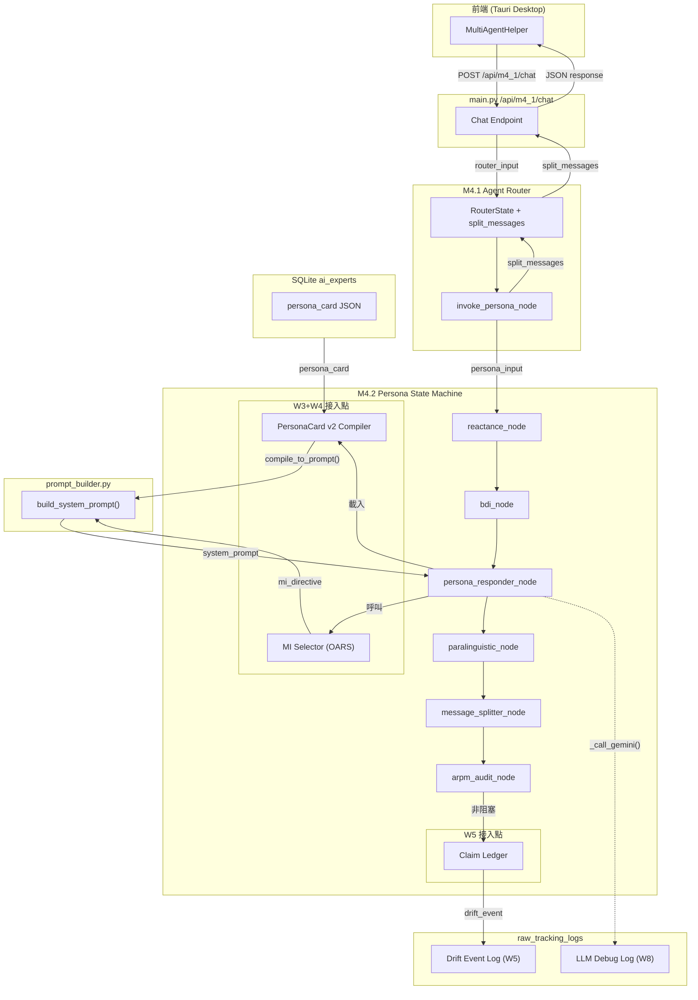

# M4.2 Persona 升級結案報告

> 本文件接續 `PERSONA_UPGRADE_PROPOSAL.md`，記錄 P0–P3 模組的 Runtime 接線完成狀態、LLM 除錯日誌架構、Regex 審計修補清單與整體架構圖。

---

## 1. 接線總覽

### 1.1 架構圖



### 1.2 資料流簡述

1. **前端** POST 至 `/api/m4_1/chat`，帶入 `role_id`, `persona_id`。
2. **main.py** 透過 `build_role_context()` 撈取含 `persona_card` 的專家列表。
3. **RouterState** 攜帶 `split_messages` 欄位。`invoke_persona_node` 呼叫 M4.2 微觀狀態機。
4. **M4.2 `persona_responder_node`**:
   - **[W3]** 若 `persona_card` 存在 → `persona_card_from_dict()` + `compile_to_prompt()` 編譯結構化人格提示詞。
   - **[W4]** 呼叫 `select_mi_technique()` → 注入 MI 行為策略指令（含禁止動作清單）。
   - **[W3]** 若有 `stances` → 注入反諂媚立場守則。
   - 最終透過 `build_system_prompt()` 拼裝完整系統提示詞。
5. **`arpm_audit_node`** [W5] 非阻塞式呼叫 `ClaimLedger.extract_claims()` + `check_contradictions()`，偵測到矛盾則 emit 至 `raw_tracking_logs`。
6. **`message_splitter_node`** 產生 `split_messages` → 透傳回 RouterState → API response。
7. **前端** [W7] 若 `split_messages.length > 1`，逐氣泡依 `delay_ms` 延遲渲染。

---

## 2. 變更清單

### 2.1 後端 (Python)

| 檔案 | 工作項 | 變更 |
|------|--------|------|
| `services/main.py` | W1 | `ai_experts` 表新增 `persona_card TEXT` 欄位（ALTER TABLE migration） |
| `services/main.py` | W2 | `_ai_generate_expert` prompt 要求 PersonaCard v2 JSON → `critic_check()` → `compile_to_prompt()` → 存入 DB |
| `services/main.py` | W6 | `/api/m4_1/chat` response 新增 `split_messages` 欄位 |
| `services/m4_1_router/graph.py` | W6 | `RouterState` 新增 `split_messages`；`invoke_persona_node` 透傳 `persona_card` + `split_messages` |
| `services/m4_1_router/routing_engine.py` | W8 | `_CloudLLMClient.complete()` 成功/失敗後 emit 結構化 LLM 日誌至 `raw_tracking_logs` |
| `services/m4_2_persona/prompt_builder.py` | W3/W4 | `build_system_prompt()` 新增 `mi_directive` + `anti_sycophancy_stances` 參數 |
| `services/m4_2_persona/graph.py` | W3 | `persona_responder_node` 載入 PersonaCard → `compile_to_prompt()` |
| `services/m4_2_persona/graph.py` | W4 | `persona_responder_node` 呼叫 `select_mi_technique()` 注入 MI 行為策略 |
| `services/m4_2_persona/graph.py` | W5 | `arpm_audit_node` 呼叫 `ClaimLedger` 背景抽取 + drift 日誌 |

### 2.2 前端 (TypeScript)

| 檔案 | 工作項 | 變更 |
|------|--------|------|
| `apps/desktop/.../m3_4_ai_helper/index.tsx` | W7 | `handleSend` 逐氣泡依 `delay_ms` 延遲渲染 |

### 2.3 Regex/Keyword 審計修補 (W9)

| 嚴重度 | 模組 | 修補內容 |
|--------|------|----------|
| 🔴 | `claim_ledger.py` | W9.1: 中文數字 regex 改為 `年\|月\|天\|日\|小時\|個月\|週\|星期`；year regex 改用 lookbehind/lookahead 避免 CJK 上下文 `\b` 失效 |
| 🔴 | `mi_selector.py` | W9.2: `CHANGE_TALK_MARKERS_ZH` 全面改為繁體中文（`我想試`, `我應該`, `也許我可以` 等 15 條） |
| 🟡 | `mi_selector.py` | W9.3: `sdt_quick_check()` 新增繁體中文 SDT 關鍵字（自主性/能力感/關聯感各 8+ 條） |
| 🟢 | `emotion.py` | W9.4: 無需修補（規則層精準覆蓋繁體中文情緒表達） |
| 🟡 | `reactance.py` | W9.5: 否定詞密度公式改為 `negations >= 3` 才計入，排除學術修辭 false positive |
| 🟡 | `project_detector.py` | W9.6: `_TRAILING_NOISE` 擴展 8 個口語化尾綴（`一下`, `看看`, `吧` 等） |
| 🟡 | `drift.py` | W9.7: 新增 5 條 prompt injection 規則（DAN、roleplay、繁中假裝/扮演） |

---

## 3. LLM 除錯日誌架構 (W8)

### 3.1 日誌寫入位置
`raw_tracking_logs` — L1 本地資料，永不上雲。

### 3.2 日誌 Schema
```json
{
  "module": "M4.1",
  "action": "llm_call",
  "level": "DEBUG",
  "payload": {
    "model": "gemini-3.1-flash",
    "prompt_text": "完整系統提示詞 + 使用者訊息",
    "response_text": "完整 LLM 回應",
    "prompt_chars": 1234,
    "response_chars": 567,
    "latency_ms": 890,
    "temperature": 0.75,
    "max_output_tokens": 400,
    "status": "success | rate_limited | exhausted",
    "error": null
  }
}
```

### 3.3 觸發時機
- `_CloudLLMClient.complete()` 成功 → status="success"
- 所有重試耗盡 → status="exhausted", error 填入原因
- `arpm_audit_node` 偵測到 persona drift → 獨立 emit (module="M4.2", action="persona_drift_detected")

### 3.4 查詢方式
```sql
SELECT * FROM raw_tracking_logs
WHERE module = 'M4.1' AND action = 'llm_call'
ORDER BY created_at DESC
LIMIT 20;
```

---

## 4. 新 PersonaCard v2 Expert 建立流程

```
使用者描述
    ↓
_ai_generate_expert (main.py)
    ↓ LLM 生成 PersonaCard v2 JSON
    ↓
persona_card_from_dict()  →  解析
critic_check()            →  校驗（Big Five 範圍、speech_profile 衝突、episode 合理性）
compile_to_prompt()       →  編譯為結構化系統提示詞
    ↓
INSERT ai_experts (personality_prompt = compiled, persona_card = raw JSON)
    ↓
Runtime: persona_responder_node 讀取 persona_card → 重新編譯
```

---

## 5. 測試結果

- M4.2 模組測試：**88 passed** (0.28s)
- 全系統迴歸測試：**408 passed**, 5 failed (均為 `test_tauri_ipc.py` 網路連線測試，與本次變更無關)

---

## 6. 風險緩解驗證

| 風險 | 緩解措施 | 驗證狀態 |
|------|----------|----------|
| RISK-02 | MI 切換登記於 `select_mi_technique()` 合法切換空間 | ✅ W4 接入 |
| RISK-03 | 焦慮狀態 → affirmation，禁鏡像列入 `forbidden_actions` | ✅ W4 接入 |
| RISK-06 | persona_card 綁定 role_id；ClaimLedger per-persona | ✅ W5 接入 |
| RISK-08 | prompt 拼裝優先序：安全 > MI > stances > 副語言 | ✅ W3/W4 prompt_builder |
| RISK-12 | PII mask 在 expert 建立時執行；claim 抽取無 PII 風險 | ✅ 既有 eguard |

---

## 7. 待辦事項

1. **PersonaMemory 持久化**：目前 ClaimLedger 為 per-invocation in-memory，未來需綁定 persona_id 持久化至 DB。
2. **EpisodicMemory 查詢接入**：`persona_memory.py` 的 `PersonaMemoryStore.retrieve()` 尚未接入 `persona_responder_node`（需 DB schema 完成）。
3. **Nightly Reflection**：`reflection_job.py` 的排程觸發器尚未接入（需 APScheduler or cron integration）。
4. **前端 typing indicator**：多氣泡延遲渲染期間，應顯示「正在輸入...」動畫。
5. **舊專家遷移工具**：提供 CLI 將既有 `ai_experts` 的純文字 `personality_prompt` 批次轉換為 PersonaCard v2 JSON。
